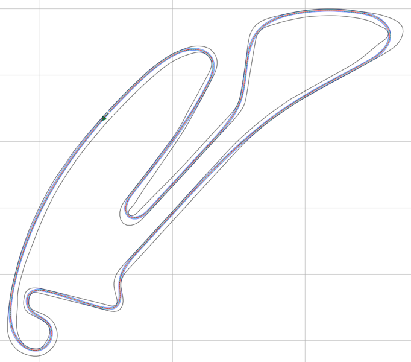

# 소개

이 리포지토리는 서킷에서 **최적 레이싱 라인**(racing line)을 계산하기 위한 알고리즘들을 포함합니다. 다음과 같은 여러 최적화 목표 중에서 선택할 수 있습니다.

- **최단 경로 (Shortest path)**
- **최소 곡률 (Minimum curvature)** — 반복 호출 여부 선택 가능
- **최소 랩타임 (Minimum time)**
- **파워트레인 거동을 고려한 최소 랩타임 (Minimum time with powertrain behavior consideration)**

최소 곡률 라인은 코너 구간에서 최소 랩타임 라인과 매우 유사하지만, 차량의 가감속 한계를 활용하지 않는 구간이 존재하면 차이가 발생합니다. 반면, **최소 랩타임 최적화**는 훨씬 더 많은 파라미터가 필요하고 계산 시간도 더 깁니다. 가능한 모든 옵션은 `main_globaltraj.py`를 참고하세요.

---

# 구성 요소 목록

- `frictionmap`: 트랙을 따라 **마찰 맵**을 생성·처리하는 함수들이 포함됩니다.
- `helper_funcs_glob`: **글로벌 레이스 트래젝터리** 계산 시 여러 곳에서 사용하는 보조 함수들이 포함됩니다.
- `inputs`: **차량 동역학 정보**, **참조 트랙 CSV**, **마찰 맵**이 포함된 폴더입니다.
- `opt_mintime_traj`: **최소 랩타임 트래젝터리**를 찾기 위한 함수들이 포함됩니다.  
  또한 `opt_mintime_traj/powertrain_src`에 **파워 손실**과 **열 거동**, **배터리 SOC**를 고려하기 위한 파워트레인 구성 요소 모델이 포함되어 있습니다.
- `params`: **최적화/차량 파라미터**가 담긴 파라미터 파일이 들어 있습니다.

---

# Trajectory Planning Helpers 저장소

트래젝터리 플래닝에 필요한 많은 함수들은 **Trajectory Planning Helpers** 저장소에 모여 있습니다.  
https://github.com/TUMFTM/trajectory_planning_helpers 에서 확인할 수 있으며, 다른 프로젝트에도 유용합니다.

---

# 의존성

리포지토리 루트의 `requirements.txt`를 사용해 필요한 모듈을 설치하세요.  
`pip3 install -r /path/to/requirements.txt`

코드는 **Ubuntu 20.04 LTS**와 **Python 3.7** 환경에서 개발되었습니다.

### (Windows) 설치 문제 해결 팁

- `cvxpy`, `cython` 등에서 **Visual C++ 컴파일러**가 필요할 경우 → Visual Studio 2019용 **Build Tools**를 설치하고, **C++ build tools** 옵션을 선택하세요. (다운로드: https://visualstudio.microsoft.com/de/downloads/ → tools for Visual Studio 2019 → build tools)
- `quadprog` 문제 → 현재 원인 불명. `0.1.7` 대신 `0.1.6` 버전 사용을 테스트해 보세요.

### (Ubuntu) 설치 문제 해결 팁

- `matplotlib`에서 `tkinter` 필요 → `sudo apt install python3-tk`
- `quadprog`에서 `Python.h` 필요 → `sudo apt install python3-dev`

---

# 사용자 정의 마찰 맵 생성

`main_gen_frictionmap.py` 스크립트를 사용해 `inputs` 폴더에 제공된 **임의의 서킷 파일**로 **자신만의 마찰 맵**을 만들 수 있습니다. 결과 맵은 `inputs/frictionmaps` 폴더에 저장됩니다. 이 마찰 맵은 **최소 랩타임 최적화**에서 사용할 수 있습니다. 원칙적으로 **최소 곡률 플래너의 속도 프로파일 계산**에도 고려할 수 있으나, 현재 본 리포지토리에서는 이를 지원하지 않습니다.

---

# 코드 실행

1. **(선택)** `params` 폴더의 파라미터 파일을 조정합니다. _(필수 파일)_
2. **(선택)** `inputs/veh_dyn_info`의 **GGV 다이어그램**과 `ax_max_machines` 파일을 조정합니다(사용 시). 이 가속도는 **공기저항을 제외**하고 계산해야 합니다. 즉, `F_x_drivetrain / m_veh`로 단순 계산합니다.
3. **(선택)** `inputs/tracks`에 **자신의 참조 트랙 파일**을 추가합니다. _(필수 파일)_
4. **(선택)** `inputs/frictionmaps`에 **자신의 마찰 맵 파일**을 추가합니다(사용 시).
5. **(선택)** **파워트레인 거동(열 거동, 손실, SOC)을 고려**하려면, 파라미터 파일(`/params`)에서 파워트레인 옵션을 활성화하고 필요한 파라미터를 조정합니다. 또한 `main_globaltraj.py`의 `imp_opts` 딕셔너리에서 **레이스 랩 수**를 설정하고, 파라미터 파일(`/params`)에서 **비정규(가변) 이산화 스텝 길이**를 지정하여 최적화를 빠르게 할 수 있습니다(사용 시).  
   - 간단한 근사 모델을 쓰려면 `/params/racecar.ini:simple_loss = True`  
   - 더 상세한 모델을 쓰려면 `/params/racecar.ini:simple_loss = False`
6. `main_globaltraj.py` **상단의 파라미터**를 조정한 뒤 실행하여 **트래젝터리 생성**을 시작합니다. 계산된 레이스 트래젝터리는 `outputs/traj_race_cl.csv`로 저장됩니다.

> **중요**: **최소 랩타임 최적화**에 대한 추가 정보는 `opt_mintime_traj` 폴더의 **해당 Readme.md**를 확인하세요!

---

# 용어 및 관례

변수 이름의 일관성을 위해 다음과 같은 용어를 사용했습니다.

- **path** → `[x, y]` 형태. 점들의 **x,y 좌표 배열**을 의미합니다.
- **refline** → `[x, y]` 형태. 계산에서 **참조선**으로 사용하는 경로입니다.
- **reftrack** → `[x, y, w_tr_right, w_tr_left]` 형태. **참조선 + 좌우 트랙 폭** 정보를 담습니다. 즉, **레이싱 라인 최적화**의 기반이 되는 **서킷 트랙** 정보입니다.

법선 벡터는 **주행 방향 기준 오른쪽**을 가리키도록 정의했습니다. 따라서 트랙 경계는 다음과 같이 얻습니다.

- 오른쪽 경계: `norm_vector * w_tr_right`
- 왼쪽 경계: `-norm_vector * w_tr_left`

---

# 트래젝터리 정의

글로벌 레이스 트래젝터리 최적화는 현재 **두 가지 출력 형식**을 지원합니다.

- **Race Trajectory** _(기본)_ — 레이스 트래젝터리에 대한 **상세 정보**를 포함합니다.
- **LTPL Trajectory** — 레이스 트래젝터리의 **원천 정보**와 **트랙 경계/참조선 정보**를 포함하며, **실제 레이스 트래젝터리는 저장된 정보로부터 재계산**해야 합니다.

이들 파일의 내보내기(Export)를 활성/비활성화하려면 `main_globtraj.py` 스크립트에서 `# assemble export paths`를 검색해 `'file_paths'` 딕셔너리에 항목을 추가/수정하세요. 기본적으로 **LTPL Trajectory의 파일 경로는 주석 처리**되어 있습니다.

아래는 각 형식에 대한 상세 설명입니다.

### Race Trajectory

출력 CSV는 **글로벌 레이스 트래젝터리**를 담습니다. 배열 크기는 `[no_points x 7]`이며, `no_points`는 **스텝 크기**와 **트랙 길이**에 따라 달라집니다. 7개 열은 다음과 같습니다.

- `s_m`: `float32`, **m** — 레이싱 라인을 따라가는 **곡선 거리(curvilinear distance)**.
- `x_m`: `float32`, **m** — 레이싱 라인의 **X 좌표**.
- `y_m`: `float32`, **m** — 레이싱 라인의 **Y 좌표**.
- `psi_rad`: `float32`, **rad** — 현재 지점의 **헤딩(방위각)**. 범위는 `-pi` ~ `+pi` rad, **0은 북쪽(y축 양의 방향)**.
- `kappa_radpm`: `float32`, **rad/m** — 현재 지점의 **곡률**.
- `vx_mps`: `float32`, **m/s** — 현재 지점의 **목표 속도**.
- `ax_mps2`: `float32`, **m/s²** — 현재 지점의 **목표 가속도**. **다음 지점까지 일정**하다고 가정합니다.

### LTPL Trajectory

출력 CSV는 **글로벌 레이스 트래젝터리의 원천 정보**와 **법선 벡터를 통한 맵 정보**를 담습니다. 배열 크기는 `[no_points x 12]`이며, `no_points`는 **스텝 크기**와 **트랙 길이**에 따라 달라집니다. 12개 열은 다음과 같습니다.

- `x_ref_m`: `float32`, **m** — **참조선(ref line)** 지점의 **X 좌표**(예: 트랙 센터라인).
- `y_ref_m`: `float32`, **m** — **참조선(ref line)** 지점의 **Y 좌표**(예: 트랙 센터라인).
- `width_right_m`: `float32`, **m** — 참조선 지점에서 **오른쪽 트랙 경계**까지의 거리(법선 벡터 방향).
- `width_left_m`: `float32`, **m** — 참조선 지점에서 **왼쪽 트랙 경계**까지의 거리(법선 벡터 반대 방향).
- `x_normvec_m`: `float32`, **m** — 참조선 지점 기준 **정규화된 법선 벡터의 X 성분**.
- `y_normvec_m`: `float32`, **m** — 참조선 지점 기준 **정규화된 법선 벡터의 Y 성분**.
- `alpha_m`: `float32`, **m** — 최적화 해(解)인 **가로 오프셋(lateral shift)**.
- `s_racetraj_m`: `float32`, **m** — **레이싱 라인**을 따른 **곡선 거리(curvilinear distance)**.
- `psi_racetraj_rad`: `float32`, **rad** — 해당 지점의 **레이싱 라인 헤딩**(`-pi` ~ `+pi`), **0은 북쪽**.
- `kappa_racetraj_radpm`: `float32`, **rad/m** — 해당 지점의 **레이싱 라인 곡률**.
- `vx_racetraj_mps`: `float32`, **m/s** — 해당 지점의 **목표 속도**.
- `ax_racetraj_mps2`: `float32`, **m/s²** — 해당 지점의 **목표 가속도**. **다음 지점까지 일정**하다고 가정합니다.

생성된 파일은 [**그래프 기반 로컬 트래젝터리 플래너**](https://github.com/TUMFTM/GraphBasedLocalTrajectoryPlanner)에서 **직접 임포트**할 수 있습니다.

---

# 참고문헌

- **Minimum Curvature Trajectory Planning**  
  Heilmeier, Wischnewski, Hermansdorfer, Betz, Lienkamp, Lohmann  
  *Minimum Curvature Trajectory Planning and Control for an Autonomous Racecar*  
  DOI: 10.1080/00423114.2019.1631455  
  연락처: [Alexander Heilmeier](mailto:alexander.heilmeier@tum.de)

- **Time-Optimal Trajectory Planning**  
  Christ, Wischnewski, Heilmeier, Lohmann  
  *Time-Optimal Trajectory Planning for a Race Car Considering Variable Tire-Road Friction Coefficients*  
  DOI: 10.1080/00423114.2019.1704804  
  연락처: [Fabian Christ](mailto:fabian.christ@tum.de)

- **Friction Map Generation**  
  Hermansdorfer, Betz, Lienkamp  
  *A Concept for Estimation and Prediction of the Tire-Road Friction Potential for an Autonomous Racecar*  
  DOI: 10.1109/ITSC.2019.8917024  
  연락처: [Leonhard Hermansdorfer](mailto:leo.hermansdorfer@tum.de)

- **Powertrain Behavior**  
  Herrmann, Passigato, Betz, Lienkamp  
  *Minimum Race-Time Planning-Strategy for an Autonomous Electric Racecar*  
  DOI: 10.1109/ITSC45102.2020.9294681  
  Preprint: https://arxiv.org/abs/2005.07127  
  연락처: [Thomas Herrmann](mailto:thomas.herrmann@tum.de)
